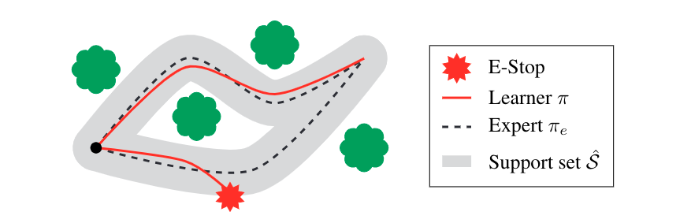

# E-stops



Here lives the source code for "Mo' States Mo' Problems: Emergency Stop Mechanisms from Observation" by [Samuel Ainsworth](http://samlikes.pizza), [Matt Barnes](https://homes.cs.washington.edu/~mbarnes/), and [Siddhartha Srinivasa](https://goodrobot.ai) presented at NeurIPS 2019.

## Usage

This package uses [pipenv](https://github.com/pypa/pipenv) to manage dependencies, so you'll need a working pipenv installation. Then get started with:

```
$ pipenv install --dev
$ pipenv run python -m research.foo.bar
```
